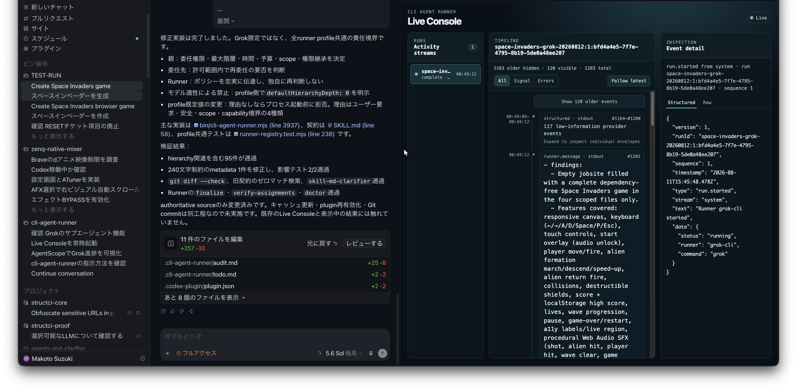
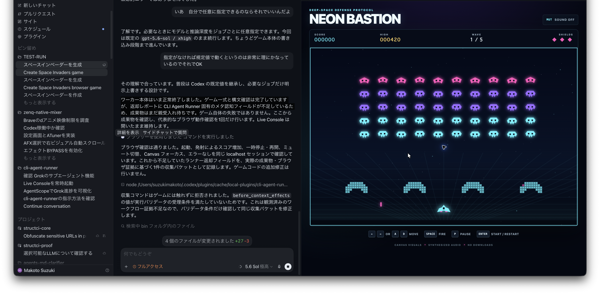
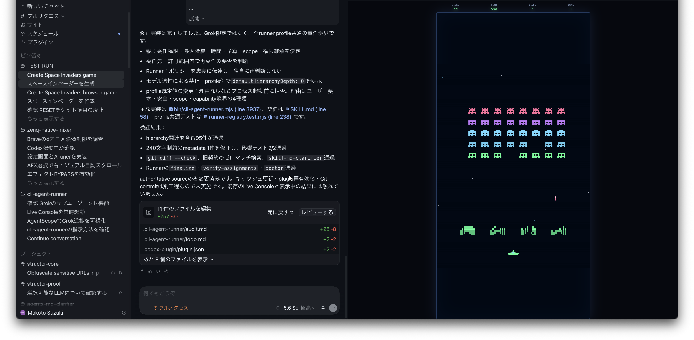
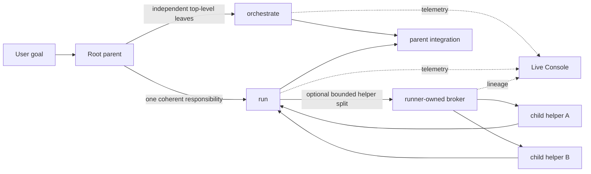

# CLI Agent Runner

[English](#english) · [日本語](#日本語)

Run Codex, Claude, Grok, or a custom CLI as a scoped worker—with a default-on Live Console and an optional runner-owned delegation layer.

Codex、Claude、Grok、任意CLIをスコープ付きworkerとして起動し、既定ONのLive Consoleと、必要時だけ使うrunner所有のローカル再委託を提供するCodexプラグインです。



<p align="center">
  
  
</p>

<p align="center"><em>One delegated implementation, visible while it runs, followed by the actual browser-game results. / 委託実装を実行中から可視化し、そのまま得られたブラウザゲームの成果例。</em></p>

## Install with Codex / Codexでインストール

This repository is agent-first installable. Give its URL to Codex and paste this request:

> Install CLI Agent Runner from https://github.com/mlabo-org/cli-agent-runner into my local Codex environment. Read the repository-root AGENTS.md first and follow its installation route. Resolve my own home directory, preserve existing marketplace entries, never edit the installed cache directly, and report the installed version plus the required restart and fresh-task verification. Do not require Claude or Grok unless I ask to use those profiles.

このリポジトリは、取得した側のCodexが初見で導入できる構成です。CodexにURLと次の依頼を渡してください。

> https://github.com/mlabo-org/cli-agent-runner から CLI Agent Runner を私のローカルCodex環境へインストールして。最初にリポジトリ直下の AGENTS.md を読み、そこに定義された導入経路に従って。私自身のホームディレクトリを解決し、既存marketplaceエントリを保全し、インストール済みcacheは直接編集せず、導入されたversionと再起動・新規taskでの確認手順まで報告して。ClaudeまたはGrokのprofileを使うよう頼むまでは、それらを導入条件にしないで。

The root `AGENTS.md` activates only for an explicit installation request. The complete mutation and stop-condition contract is in [`docs/INSTALL_FOR_CODEX.md`](docs/INSTALL_FOR_CODEX.md); normal repository work never triggers installation.

## English

### What it does

CLI Agent Runner gives a parent Codex task one provider-neutral process boundary for CLI workers:

- `codex-cli`, `claude-cli`, and `grok-cli` are bundled profiles.
- JSON configuration can add or override profiles without provider-specific execution code.
- Every worker receives a target repository, caller-defined responsibility role, task identity, machine-checkable write scope, assignment, and expected output.
- `--role` accepts any non-empty single-line label. CLI Agent Runner has no built-in or preallocated role roster.
- stdout, stderr, structured provider events, normalized results, and brokered child lineage can be observed in the loopback-only Live Console.
- Repository scope is checked after execution. Out-of-scope changes remain an explicit failure.

The plugin does not replace official Codex subagents. Use it when the user explicitly wants a local CLI LLM, its streaming output, a custom runner profile, or the bundled Live Console.

### Responsibility model

The root parent still owns the user goal, top-level decomposition, authority, concurrency, integration, and final acceptance. Deeper delegation exists for a narrower case: one assigned worker owns a coherent responsibility but can save time by splitting bounded internal helper work that it will integrate itself.



This keeps the layers distinct:

- The parent uses `orchestrate` only for independently owned, non-overlapping top-level work.
- A worker uses `local_orchestrator` only inside its inherited authority and returns one integrated result.
- A hierarchy depth is a permission ceiling, not a demand to create more agents.
- Provider-private descendants that bypass the broker cannot appear as tracked Live Console lineage.

### Execution modes

| Mode | Use when | Who integrates |
|---|---|---|
| `run` | One worker can own the complete scoped assignment | Root parent |
| `run --delegation-mode local_orchestrator` | That one worker has a useful bounded internal split | The assigned worker, then the root parent |
| `orchestrate --jobs-file ...` | The parent has independent, non-overlapping responsibility leaves | Root parent |

After a successful in-scope process result, the runner stops. It does not automatically add a reviewer, validator, collection, or finalization chain.

### Requirements

- macOS with Codex desktop and a Codex CLI that exposes plugin commands.
- Git.
- Node.js 22 or later. The runtime uses Node standard libraries and has no package dependencies.
- An authenticated CLI for each selected runner profile:

| Profile | Command | Required only when selected |
|---|---|---|
| `codex-cli` | `codex` | Yes; also used for plugin installation |
| `claude-cli` | `claude` | Yes |
| `grok-cli` | `grok` | Yes |

Installing the plugin does not install or authenticate provider CLIs.

### Manual installation

The agent-first route above is preferred. For a manual install, use the canonical personal-plugin path. If the destination already exists, inspect it first and do not overwrite unrelated work.

```sh
git clone https://github.com/mlabo-org/cli-agent-runner.git "$HOME/plugins/cli-agent-runner"
cd "$HOME/plugins/cli-agent-runner"
npm run check
npm run plugin:install:check
npm run plugin:install
```

`plugin:install:check` is read-only. `plugin:install` preserves unrelated entries in `~/.agents/plugins/marketplace.json`, installs through `codex plugin add`, and verifies the installed manifest version. Restart Codex afterward and open a fresh task.

Fresh-task verification prompt:

> Explain CLI Agent Runner's trigger boundary, bundled runners, and default Live Console behavior. Do not start a CLI worker yet.

### Run one worker

From the repository root:

```sh
node bin/cli-agent-runner.mjs run \
  --target-cwd /path/to/jobsite \
  --role "Rust Protocol Repair Owner" \
  --task-id focused-change \
  --epoch e1 \
  --scope "scope:v1 paths=src/,tests/" \
  --assignment "Implement the scoped change" \
  --expected-output "Changed files and verification" \
  --runner codex-cli
```

Direct `run` and `orchestrate` commands start a token-protected loopback Live Console by default and keep the completed page available until Ctrl-C. Use `--no-live-console` or `--silent` only when console-free operation is explicitly intended.

### Let one worker delegate internally

```sh
node bin/cli-agent-runner.mjs run \
  --target-cwd /path/to/jobsite \
  --role "Release Integration Owner" \
  --task-id local-team \
  --epoch e1 \
  --scope "scope:v1 paths=src/,tests/" \
  --delegation-mode local_orchestrator \
  --assignment "Own this coherent implementation and delegate only bounded internal helpers" \
  --expected-output "One integrated implementation result" \
  --runner claude-cli
```

Explicit local-orchestrator mode supplies one direct-child level when the selected profile has no hierarchy default. The worker-only `delegate` command is injected into that worker. Calling `delegate` from an ordinary parent shell fails closed.

### Run independent parent-declared jobs

Create a version-1 jobs file:

```json
{
  "version": 1,
  "jobs": [
    {
      "id": "docs",
      "role": "Public Documentation Owner",
      "ownerScope": "README.md",
      "assignment": "Update the public contract.",
      "expectedOutput": "Updated README."
    },
    {
      "id": "tests",
      "role": "Workflow Contract Verifier",
      "ownerScope": "tests/",
      "assignment": "Add the scoped behavior tests.",
      "expectedOutput": "Changed tests and results."
    }
  ]
}
```

Then run:

```sh
node bin/cli-agent-runner.mjs orchestrate \
  --target-cwd /path/to/jobsite \
  --task-id public-contract \
  --epoch e1 \
  --scope "scope:v1 paths=README.md,tests/" \
  --runner grok-cli \
  --jobs-file /path/to/jobs.json
```

Every `ownerScope` must be inside the top-level scope and pairwise non-overlapping with concurrent jobs.

### Custom runners and state

Runner configuration precedence is bundled defaults, user config, `CLI_AGENT_RUNNER_CONFIG`, then `--runner-config`. Jobsite `.cli-agent-runner/` is workflow state only and is never loaded as executable runner configuration. See [`docs/runner-configuration.md`](docs/runner-configuration.md) for the schema and examples.

Workflow state lives in the target Git repository's `.cli-agent-runner/` directory. The tool adds that directory to the target repository's local `.git/info/exclude`; it does not silently change the tracked `.gitignore`.

See [`docs/live-console.md`](docs/live-console.md) for the event, token, IAB handoff, and parent-child lineage contract.

### Security boundaries

- Live Console binds to loopback and requires its generated token. Treat the full tokenized URL as sensitive local telemetry; do not paste it into commits, logs, issues, or remote messages.
- Runner profiles execute local commands with their configured arguments and inherited environment. Treat third-party runner JSON as executable code, review it before use, and keep custom config outside worker-writable jobsites.
- Machine scopes are fail-closed post-run Git change checks, not write containment. They do not see ignored or out-of-repository writes and do not replace the selected provider's own permission model or an OS sandbox.
- Plugin source is authoritative. Never patch `~/.codex/plugins/cache/` directly.

For vulnerability reports, see [`SECURITY.md`](SECURITY.md).

### Development

```sh
npm run check
npm run test:cli
npm run test:live
```

The complete test suite is the release check. See [`CONTRIBUTING.md`](CONTRIBUTING.md) before opening a pull request.

## 日本語

### このプラグインが行うこと

CLI Agent Runnerは、親Codex taskからCLI workerを起動するためのprovider非依存な実行境界を提供します。

- `codex-cli`、`claude-cli`、`grok-cli`を標準profileとして同梱します。
- JSON設定により、provider固有の実行分岐を追加せずprofileを追加・上書きできます。
- 各workerへ対象repository、呼び出し側が定義した責務role、task identity、機械判定可能なwrite scope、assignment、expected outputを渡します。
- `--role`は空でない一行の任意名を受理します。組み込み・事前確保済みのrole名簿はありません。
- stdout、stderr、providerのstructured event、正規化結果、broker経由のchild lineageをloopback専用Live Consoleで観測できます。
- 実行後にrepository scopeを検査し、範囲外変更は明示的な失敗として残します。

このプラグインはCodex公式subagentの代替ではありません。ユーザーがローカルCLI LLM、そのstreaming output、custom runner profile、またはLive Consoleを明示的に求めた場合に使います。

### 責務モデル

root parentは、ユーザー目標、最上位のtask分割、権限、並列数、統合、最終acceptanceを引き続き所有します。さらに一段深い委託が必要になるのは限定的です。すなわち、一つのcoherentな責務を任されたworkerが、自分で統合できるboundedな内部helperへ分けることで時間を短縮できる場合です。

- 親は、独立所有でき、scopeが重ならない最上位workだけを`orchestrate`へ渡します。
- workerは、継承した権限内の内部再分割だけを`local_orchestrator`で行い、一つの統合済み結果を返します。
- hierarchy depthは許可上限であり、agentを増やす命令ではありません。
- brokerを迂回したprovider独自descendantは、Live Consoleの追跡lineageには現れません。

### 実行モード

| Mode | 選ぶ条件 | 統合責任 |
|---|---|---|
| `run` | 一つのworkerがscope内のassignmentを完結できる | root parent |
| `run --delegation-mode local_orchestrator` | そのworker内部に有効なbounded splitがある | assigned worker、その後root parent |
| `orchestrate --jobs-file ...` | 親が独立・非重複の責務leafを確定済み | root parent |

scope内でprocess resultが成功した時点でrunnerは終了します。reviewer、validator、collection、finalizationのchainを自動追加しません。

### 必要環境

- Codex desktopとplugin commandを備えたCodex CLIが動くmacOS。
- Git。
- Node.js 22以降。runtimeはNode標準libraryのみを使い、package dependencyはありません。
- 実際に選ぶrunner profileに対応した認証済みCLI。

| Profile | Command | 必要になる時点 |
|---|---|---|
| `codex-cli` | `codex` | 選択時。plugin導入にも使用 |
| `claude-cli` | `claude` | 選択時のみ |
| `grok-cli` | `grok` | 選択時のみ |

pluginの導入はprovider CLIのインストールや認証を行いません。

### 手動インストール

通常は冒頭のagent-first導入を使ってください。手動の場合もpersonal pluginのcanonical pathへ置きます。既にdestinationがある場合は先に内容を確認し、無関係な変更を上書きしないでください。

```sh
git clone https://github.com/mlabo-org/cli-agent-runner.git "$HOME/plugins/cli-agent-runner"
cd "$HOME/plugins/cli-agent-runner"
npm run check
npm run plugin:install:check
npm run plugin:install
```

`plugin:install:check`はread-onlyです。`plugin:install`は`~/.agents/plugins/marketplace.json`の無関係なentryを保全し、`codex plugin add`で導入し、manifest versionまで確認します。完了後にCodexを再起動し、新しいtaskを開いてください。

新規taskでの確認prompt:

> CLI Agent Runner の利用条件、標準 runner、Live Console の既定動作を説明して。CLI worker はまだ起動しないで。

### 一つのworkerを起動する

repository rootから実行します。

```sh
node bin/cli-agent-runner.mjs run \
  --target-cwd /path/to/jobsite \
  --role "Rust Protocol Repair Owner" \
  --task-id focused-change \
  --epoch e1 \
  --scope "scope:v1 paths=src/,tests/" \
  --assignment "Implement the scoped change" \
  --expected-output "Changed files and verification" \
  --runner codex-cli
```

直接実行した`run`と`orchestrate`は、token保護されたloopback Live Consoleを既定で起動し、完了画面をCtrl-Cまで保持します。consoleなしを明示した場合だけ`--no-live-console`または`--silent`を使います。

### 一つのworkerに内部再委託を許可する

```sh
node bin/cli-agent-runner.mjs run \
  --target-cwd /path/to/jobsite \
  --role "Release Integration Owner" \
  --task-id local-team \
  --epoch e1 \
  --scope "scope:v1 paths=src/,tests/" \
  --delegation-mode local_orchestrator \
  --assignment "Own this coherent implementation and delegate only bounded internal helpers" \
  --expected-output "One integrated implementation result" \
  --runner claude-cli
```

選択profileにhierarchy既定値がない場合、明示的なlocal-orchestrator modeはdirect child一段分を与えます。worker専用`delegate` commandはそのworkerへ注入され、通常の親shellから呼ぶとfail closedします。

### 親が定義した独立jobを並列実行する

version 1のjobs fileを作成します。

```json
{
  "version": 1,
  "jobs": [
    {
      "id": "docs",
      "role": "Public Documentation Owner",
      "ownerScope": "README.md",
      "assignment": "Update the public contract.",
      "expectedOutput": "Updated README."
    },
    {
      "id": "tests",
      "role": "Workflow Contract Verifier",
      "ownerScope": "tests/",
      "assignment": "Add the scoped behavior tests.",
      "expectedOutput": "Changed tests and results."
    }
  ]
}
```

続けて実行します。

```sh
node bin/cli-agent-runner.mjs orchestrate \
  --target-cwd /path/to/jobsite \
  --task-id public-contract \
  --epoch e1 \
  --scope "scope:v1 paths=README.md,tests/" \
  --runner grok-cli \
  --jobs-file /path/to/jobs.json
```

各`ownerScope`はtop-level scope内にあり、同時実行job間で重複してはいけません。

### Custom runnerとstate

runner設定の優先順位は、bundled defaults、user config、`CLI_AGENT_RUNNER_CONFIG`、`--runner-config`です。jobsiteの`.cli-agent-runner/`はworkflow state専用で、実行可能なrunner設定として読み込みません。schemaと例は[`docs/runner-configuration.md`](docs/runner-configuration.md)を参照してください。

workflow stateは対象Git repositoryの`.cli-agent-runner/`に置かれます。toolは対象repositoryのlocalな`.git/info/exclude`へこのdirectoryを追加し、tracked `.gitignore`を暗黙変更しません。

event、token、IAB handoff、parent-child lineageの契約は[`docs/live-console.md`](docs/live-console.md)を参照してください。

### セキュリティ境界

- Live Consoleはloopbackへbindし、生成tokenを要求します。token付きURL全体をsensitiveなlocal telemetryとして扱い、commit、log、issue、remote messageへ貼らないでください。
- runner profileは設定されたargumentと継承environmentでlocal commandを実行します。third-party runner JSONは実行可能codeとして使用前に確認し、custom configはworkerが書き込めるjobsite外へ置いてください。
- machine scopeはfail-closedな実行後Git変更検査であり、write containmentではありません。ignored pathやrepository外への書き込みは検出せず、選択provider自身のpermission modelやOS sandboxを置き換えません。
- plugin sourceが正本です。`~/.codex/plugins/cache/`を直接patchしないでください。

脆弱性報告は[`SECURITY.md`](SECURITY.md)を参照してください。

### 開発

```sh
npm run check
npm run test:cli
npm run test:live
```

complete test suiteがrelease checkです。pull requestを作る前に[`CONTRIBUTING.md`](CONTRIBUTING.md)を確認してください。

## License

MIT License. Copyright (c) 2026 Makoto Suzuki.
