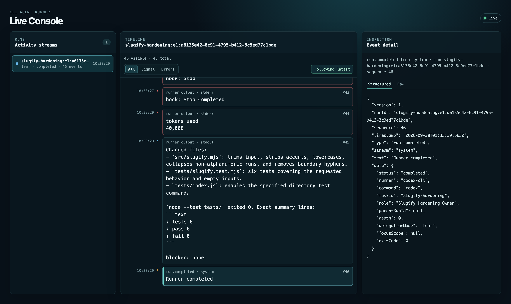
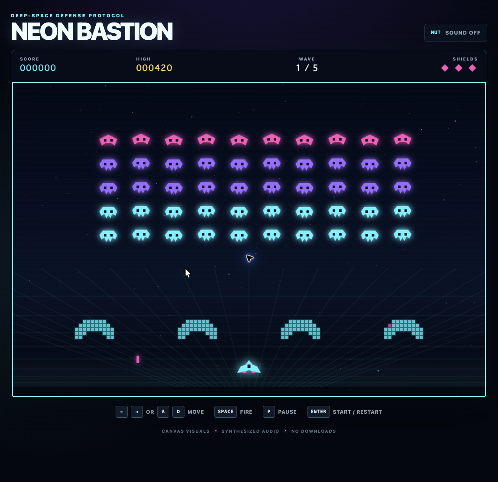
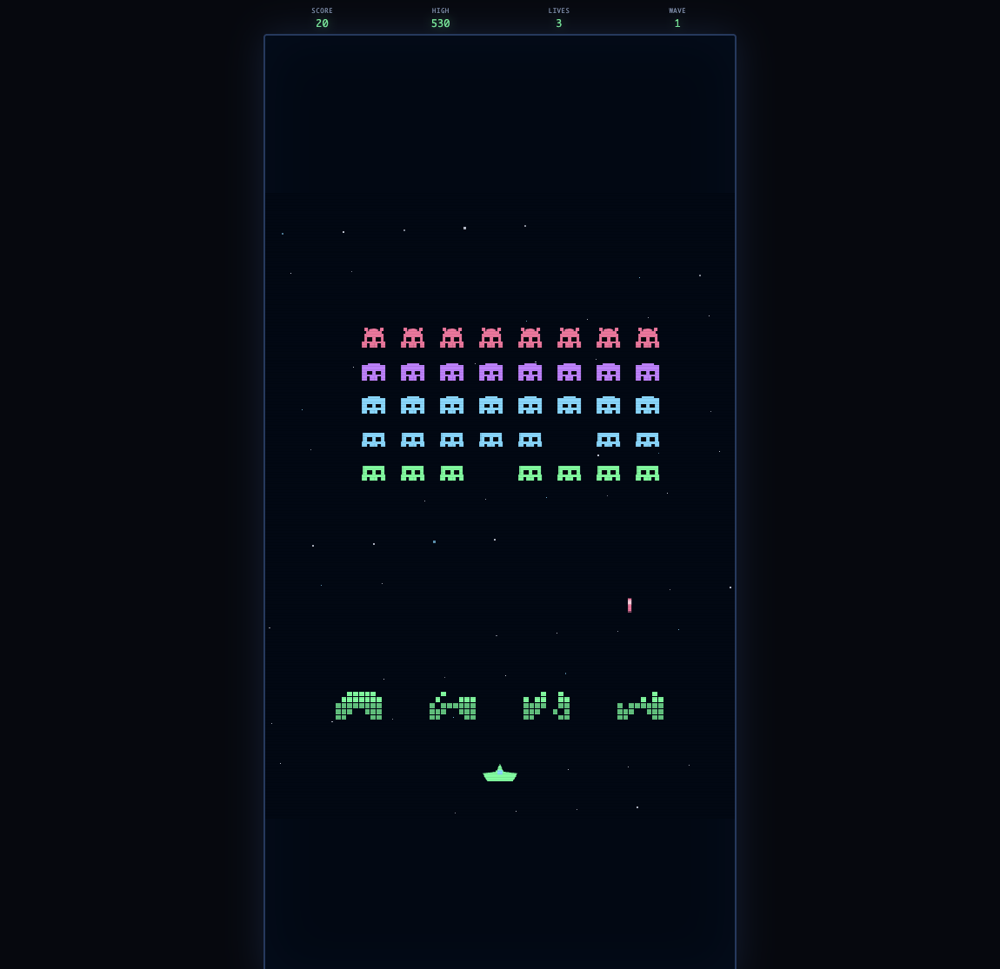
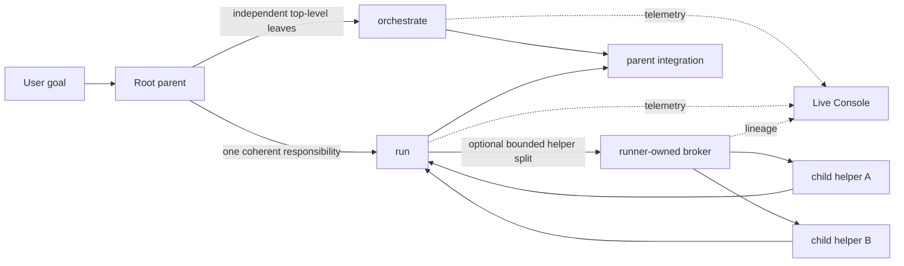
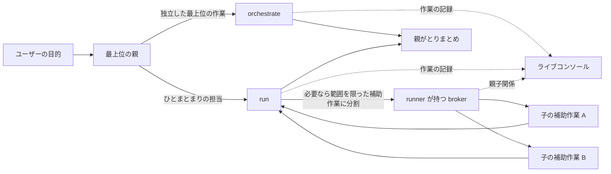

# CLI Agent Runner

[English](#english) · [日本語](#日本語)

Run Codex, Claude, Grok, or any CLI you configure as a scoped worker, watch it live in a local console, and let one worker split off bounded helpers only when that actually saves time. One plugin for both Codex and Claude Code.

Codex・Claude・Grok、または自分で登録した任意の CLI を、作業範囲を限った worker（作業役）として起動するプラグインです。作業の様子はローカルのライブコンソールでその場で確認でき、時間の短縮になるときだけ、worker に範囲を限った補助作業を分けさせることもできます。Codex と Claude Code の両方で使えます。



<p align="center"><em>The Live Console after a Codex worker hardened a function and passed its tests: runs on the left, the event timeline in the middle, the selected event's full record on the right. / Codex の worker が関数を改良してテストを通した直後のライブコンソール。左が実行の一覧、中央が出来事の時系列、右が選んだ出来事の記録全体です。</em></p>

<p align="center">
  
  
</p>

<p align="center"><em>Browser games built end to end by CLI workers launched through the runner. / runner から起動した CLI の worker が、最初から最後まで作り上げたブラウザゲームの例。</em></p>

## Install / インストール

Let your agent install it. Paste one of these requests into Codex or Claude Code; the agent reads this repository and installs the plugin by itself.

エージェントに任せて入れてください。Codex か Claude Code に次の依頼を貼り付ければ、エージェントがこのリポジトリを読んで、自分でプラグインを導入します。

**Codex**

> Install CLI Agent Runner from https://github.com/mlabo-org/cli-agent-runner into my local Codex environment. Read the repository-root AGENTS.md first and follow its installation route. Resolve my own home directory, preserve existing marketplace entries, never edit the installed cache directly, and report the installed version plus the required restart and fresh-task verification. Do not require Claude or Grok unless I ask to use those profiles.

> https://github.com/mlabo-org/cli-agent-runner から CLI Agent Runner を私のローカルの Codex 環境へインストールして。最初にリポジトリ直下の AGENTS.md を読み、そこに書かれた導入手順に従って。私自身のホームディレクトリを使い、既存のマーケットプレイスの登録は残し、インストール済みのキャッシュは直接編集しないで。導入したバージョンと、再起動・新しいタスクでの確認手順まで報告して。Claude や Grok のプロファイルは、私が使うと言うまで導入の条件にしないで。

**Claude Code**

> Install CLI Agent Runner from https://github.com/mlabo-org/cli-agent-runner into my Claude Code environment. Read the repository-root AGENTS.md first and follow its Claude Code installation route. Preserve existing marketplaces and plugins, never edit the installed cache directly, and report the installed version plus the new-session verification. Do not require Codex or Grok unless I ask to use those profiles.

> https://github.com/mlabo-org/cli-agent-runner から CLI Agent Runner を私の Claude Code 環境へインストールして。最初にリポジトリ直下の AGENTS.md を読み、そこに書かれた Claude Code 向けの導入手順に従って。既存のマーケットプレイスとプラグインは残し、インストール済みのキャッシュは直接編集しないで。導入したバージョンと、新しいセッションでの確認手順まで報告して。Codex や Grok のプロファイルは、私が使うと言うまで導入の条件にしないで。

The root `AGENTS.md` (which `CLAUDE.md` points to) takes effect only for an explicit installation request; ordinary work in this repository never triggers installation. It sends each agent to its own contract, which lists every change the agent may make and when it must stop: [`docs/INSTALL_FOR_CODEX.md`](docs/INSTALL_FOR_CODEX.md) and [`docs/INSTALL_FOR_CLAUDE_CODE.md`](docs/INSTALL_FOR_CLAUDE_CODE.md).

リポジトリ直下の `AGENTS.md`（`CLAUDE.md` はここを指すだけです）が働くのは、インストールをはっきり頼まれたときだけです。このリポジトリでの普段の作業で、インストールが始まることはありません。`AGENTS.md` はエージェントごとの手順書へ案内し、そこに、エージェントが変更してよい範囲と止まるべき条件がすべて書いてあります。手順書は [`docs/INSTALL_FOR_CODEX.md`](docs/INSTALL_FOR_CODEX.md) と [`docs/INSTALL_FOR_CLAUDE_CODE.md`](docs/INSTALL_FOR_CLAUDE_CODE.md) です。

## English

### What it does

CLI Agent Runner gives a parent Codex or Claude Code task a single, provider-neutral way to launch CLI workers:

- `codex-cli`, `claude-cli`, and `grok-cli` are bundled profiles.
- JSON configuration adds or overrides profiles without provider-specific execution code.
- Every worker receives a target repository, a responsibility role you name, a task identity, a machine-checkable write scope, an assignment, and the expected output.
- `--role` accepts any non-empty single-line label. There is no built-in or preallocated role roster.
- The loopback-only Live Console shows stdout, stderr, structured provider events, normalized results, and the lineage of brokered child helpers.
- Scope is checked on both sides of a run. The runner refuses to launch while files outside the scope have uncommitted changes, and any out-of-scope change left after the run is reported as an explicit failure.
- A worker that exits with code 0 but reports a blocker in its result is recorded as failed, not completed.

This plugin does not replace the host's official subagents (Codex subagents or the Claude Code Agent tool). Use it when you explicitly want a local CLI LLM, its streaming output, a custom runner profile, or the bundled Live Console.

### Responsibility model

The root parent keeps ownership of the user's goal, the top-level split, authority, concurrency, integration, and final acceptance. Deeper delegation covers one narrower case: a worker that owns one coherent responsibility can save time by splitting off bounded helper work that it integrates itself.


```mermaid
flowchart LR
  U["User goal"] --> P["Root parent"]
  P -->|"independent top-level leaves"| O["orchestrate"]
  P -->|"one coherent responsibility"| R["run"]
  R -->|"optional bounded helper split"| B["runner-owned broker"]
  B --> C1["child helper A"]
  B --> C2["child helper B"]
  C1 --> R
  C2 --> R
  O --> L["parent integration"]
  R --> L
  O -. telemetry .-> V["Live Console"]
  R -. telemetry .-> V
  B -. lineage .-> V
```

This keeps the layers apart:

- The parent uses `orchestrate` only for independently owned top-level work whose scopes do not overlap.
- A worker uses `local_orchestrator` only within the authority it inherited, and returns one integrated result.
- A hierarchy depth is a permission ceiling, not an instruction to create more agents.
- Descendants that a provider spawns on its own, bypassing the broker, cannot appear as tracked lineage in the Live Console.

### Execution modes

| Mode | Use when | Who integrates |
|---|---|---|
| `run` | One worker can own the complete scoped assignment | Root parent |
| `run --delegation-mode local_orchestrator` | That one worker has a useful bounded internal split | The assigned worker, then the root parent |
| `orchestrate --jobs-file ...` | The parent has independent responsibility leaves whose scopes do not overlap | Root parent |

Once a run finishes successfully within its scope, the runner stops. It does not automatically add a reviewer, validator, collection, or finalization step.

### Requirements

- macOS with Codex desktop and a Codex CLI that exposes plugin commands, or with Claude Code.
- Git. The target (jobsite) must be inside a Git repository.
- Node.js 22 or later. The runtime uses only the Node standard library and has no package dependencies.
- An authenticated CLI for each runner profile you actually select:

| Profile | Command | Needed |
|---|---|---|
| `codex-cli` | `codex` | Only when selected; also used to install the plugin into Codex |
| `claude-cli` | `claude` | Only when selected |
| `grok-cli` | `grok` | Only when selected |

Installing the plugin does not install or authenticate any provider CLI.

### Manual installation

Letting your agent install it, as shown above, is the intended route. The commands below are what the agents run, for readers who want to see or do it by hand.

<details>
<summary>Claude Code</summary>

```sh
claude plugin marketplace add mlabo-org/cli-agent-runner
claude plugin install cli-agent-runner@cli-agent-runner
```

Open a new Claude Code session afterward. If `claude plugin list` already shows `cli-agent-runner` from another marketplace, update that copy instead of installing a second one.

</details>

<details>
<summary>Codex</summary>

Place the repository at the canonical personal-plugin path. The commands below clone only when the destination does not exist. An existing destination is used only when it is a checkout of this repository with a matching `origin` and no uncommitted changes; otherwise they stop without touching it.

```sh
REPO=https://github.com/mlabo-org/cli-agent-runner.git
DEST="$HOME/plugins/cli-agent-runner"
ready=
if [ ! -e "$DEST" ]; then
  git clone "$REPO" "$DEST" && ready=1
elif [ -d "$DEST/.git" ] &&
     [ "$(git -C "$DEST" remote get-url origin)" = "$REPO" ] &&
     [ -z "$(git -C "$DEST" status --porcelain)" ]; then
  ready=1
else
  echo "Stopped: $DEST exists but is not a clean checkout of $REPO" >&2
fi
[ -n "$ready" ] && cd "$DEST" &&
  npm run check &&
  npm run plugin:install:check &&
  npm run plugin:install
```

`plugin:install:check` only reads. `plugin:install` keeps unrelated entries in `~/.agents/plugins/marketplace.json`, installs through `codex plugin add`, and verifies the installed manifest version. Restart Codex afterward and open a new task.

</details>

Prompt to check the install in a new task or session:

> Explain CLI Agent Runner's trigger boundary, bundled runners, and default Live Console behavior. Do not start a CLI worker yet.

### Run one worker

Every run belongs to a task recorded by `intake`. Record the task first, then launch the worker with the same `--task-id`, `--epoch`, and `--scope`. If any of the three differs from the recorded task, the runner refuses to launch. From the repository root:

```sh
node bin/cli-agent-runner.mjs intake \
  --target-cwd /path/to/jobsite \
  --task "Repair the protocol parser" \
  --task-id focused-change \
  --epoch e1 \
  --scope "scope:v1 paths=src/,tests/"

node bin/cli-agent-runner.mjs run \
  --target-cwd /path/to/jobsite \
  --role "Rust Protocol Repair Owner" \
  --task-id focused-change \
  --epoch e1 \
  --scope "scope:v1 paths=src/,tests/" \
  --assignment "Implement the scoped change" \
  --expected-output "Changed files and verification" \
  --runner codex-cli
```

`--scope` takes either `scope:v1 all` for the whole repository or `scope:v1 paths=<comma-separated repo-relative prefixes>`. Commit or remove changes outside the scope before launching, or include those paths in the scope.

Direct `run` and `orchestrate` commands start a token-protected loopback Live Console by default and keep the finished page open until you press Ctrl-C. Use `--no-live-console` or `--silent` only when you explicitly want to run without a console.

`node bin/cli-agent-runner.mjs --help` lists every command and option, including `--timeout-ms`, supervision timings, `--work-type`, and `--feature-profile`.

### Let one worker delegate internally

```sh
node bin/cli-agent-runner.mjs run \
  --target-cwd /path/to/jobsite \
  --role "Release Integration Owner" \
  --task-id local-team \
  --epoch e1 \
  --scope "scope:v1 paths=src/,tests/" \
  --delegation-mode local_orchestrator \
  --assignment "Own this coherent implementation and delegate only bounded internal helpers" \
  --expected-output "One integrated implementation result" \
  --runner claude-cli
```

As with every run, record the task with `intake` first. When the selected profile declares no default hierarchy depth, explicit local-orchestrator mode grants one level of direct children. The bundled `grok-cli` profile already allows one level by default; `codex-cli` and `claude-cli` allow none unless you pass this mode. The worker-only `delegate` command is injected into that worker; calling it from an ordinary parent shell fails closed.

### Run independent parent-declared jobs

Create a version-1 jobs file:

```json
{
  "version": 1,
  "jobs": [
    {
      "id": "docs",
      "role": "Public Documentation Owner",
      "ownerScope": "README.md",
      "assignment": "Update the public contract.",
      "expectedOutput": "Updated README."
    },
    {
      "id": "tests",
      "role": "Workflow Contract Verifier",
      "ownerScope": "tests/",
      "assignment": "Add the scoped behavior tests.",
      "expectedOutput": "Changed tests and results."
    }
  ]
}
```

Record the task with `intake` using the same top-level `--task-id`, `--epoch`, and `--scope`, then run:

```sh
node bin/cli-agent-runner.mjs orchestrate \
  --target-cwd /path/to/jobsite \
  --task-id public-contract \
  --epoch e1 \
  --scope "scope:v1 paths=README.md,tests/" \
  --runner grok-cli \
  --jobs-file /path/to/jobs.json
```

Every `ownerScope` must lie inside the top-level scope and must not overlap any other job running at the same time. All jobs share one Live Console, each with its own run ID.

### Custom runners and state

Runner configuration is applied in this order, later entries overriding earlier ones: bundled defaults, user config, `CLI_AGENT_RUNNER_CONFIG`, then `--runner-config`. The jobsite's `.cli-agent-runner/` holds workflow state only and is never loaded as runner configuration. See [`docs/runner-configuration.md`](docs/runner-configuration.md) for the schema and examples.

Workflow state lives in the target Git repository's `.cli-agent-runner/` directory. The tool adds that directory to the target repository's local `.git/info/exclude`; it never changes the tracked `.gitignore`.

See [`docs/live-console.md`](docs/live-console.md) for the event format, token, host-browser handoff, and parent-child lineage contract.

### Security boundaries

- The Live Console binds to loopback and requires its generated token. Treat the full tokenized URL as sensitive local telemetry; do not paste it into commits, logs, issues, or remote messages.
- Runner profiles execute local commands with their configured arguments and the inherited environment. Treat third-party runner JSON as executable code, review it before use, and keep custom config outside any jobsite a worker can write to.
- Machine scopes are fail-closed Git change checks made before launch and after the run; they do not contain writes. They cannot see writes to ignored paths or outside the repository, and they do not replace the selected provider's own permission model or an OS sandbox.
- The plugin source is authoritative. Never patch `~/.codex/plugins/cache/` or `~/.claude/plugins/cache/` directly.

To report a vulnerability, see [`SECURITY.md`](SECURITY.md).

### Development

```sh
npm run check
npm run test:cli
npm run test:live
```

`npm run check` runs the complete test suite and is the release check. Read [`CONTRIBUTING.md`](CONTRIBUTING.md) before opening a pull request.

## 日本語

### できること

CLI Agent Runner は、親の Codex や Claude Code のタスクから CLI の worker を起動するための、特定のモデルや提供元に依存しない共通の仕組みです。

- `codex-cli`、`claude-cli`、`grok-cli` の 3 つのプロファイルを同梱しています。
- JSON の設定を書けば、提供元ごとの特別な処理を足さずに、プロファイルを追加したり上書きしたりできます。
- 各 worker には、対象のリポジトリ、呼び出す側が名付けた担当（role）、タスクの識別情報、機械的に判定できる書き込み範囲（scope）、依頼内容、期待する出力を渡します。
- `--role` には、空でない 1 行の名前なら何でも付けられます。あらかじめ用意された担当の一覧はありません。
- 標準出力・標準エラー出力、提供元が出す構造化されたイベント、整えた結果、broker 経由で起動した子の補助作業の親子関係を、自分のマシンの中からだけ開けるライブコンソールで確認できます。
- 書き込み範囲は、実行の前と後の両方で確かめます。範囲の外にコミットしていない変更があると起動を断り、実行後に範囲の外が変わっていれば、はっきり失敗として記録します。
- worker が終了コード 0 で終わっても、結果の中で作業を止める問題（blocker）を報告していれば、完了ではなく失敗として記録します。

このプラグインは、ホストに標準で備わっているサブエージェント（Codex のサブエージェントや、Claude Code の Agent ツール）の代わりではありません。ローカルの CLI 版の LLM を使いたいとき、その出力を流しながら見たいとき、独自のプロファイルを使いたいとき、同梱のライブコンソールを使いたいときに、はっきり指定して使います。

### 責任の分け方

ユーザーの目的、最上位での作業の分け方、権限、同時に動かす数、結果のとりまとめ、最終的な採否は、これまでどおり最上位の親が持ちます。さらに一段深く任せるのは、限られた場面だけです。ひとまとまりの担当を任された worker が、自分でとりまとめられる範囲の補助作業に分けることで、時間を短縮できる場合です。


```mermaid
flowchart LR
  U["ユーザーの目的"] --> P["最上位の親"]
  P -->|"独立した最上位の作業"| O["orchestrate"]
  P -->|"ひとまとまりの担当"| R["run"]
  R -->|"必要なら範囲を限った補助作業に分割"| B["runner が持つ broker"]
  B --> C1["子の補助作業 A"]
  B --> C2["子の補助作業 B"]
  C1 --> R
  C2 --> R
  O --> L["親がとりまとめ"]
  R --> L
  O -. 作業の記録 .-> V["ライブコンソール"]
  R -. 作業の記録 .-> V
  B -. 親子関係 .-> V
```

これで、それぞれの層の役割が混ざりません。

- 親が `orchestrate` に渡すのは、別々の担当が持てて、範囲が重ならない最上位の作業だけです。
- worker が `local_orchestrator` で分けるのは、自分が受け継いだ権限の中の作業だけで、最後に 1 つにまとめた結果を返します。
- 階層の深さ（hierarchy depth）は「ここまで任せてよい」という上限で、エージェントを増やせという指示ではありません。
- 提供元が broker を通さずに独自に起動した子は、ライブコンソールの親子関係には表示されません。

### 実行のしかた

| モード | 選ぶ場面 | とりまとめる人 |
|---|---|---|
| `run` | 1 つの worker が、範囲内の依頼を最後まで担当できる | 最上位の親 |
| `run --delegation-mode local_orchestrator` | その worker の中で、範囲を限った補助作業に分けると役に立つ | 任された worker、その後に最上位の親 |
| `orchestrate --jobs-file ...` | 親が、互いに独立していて範囲も重ならない担当に分け終えている | 最上位の親 |

範囲内で実行が成功した時点で、runner は止まります。レビュー役や検証役、結果の回収やとりまとめの手順を、勝手に付け足すことはありません。

### 必要な環境

- Codex デスクトップ版とプラグイン用のコマンドを備えた Codex CLI、または Claude Code が動く macOS。
- Git。作業対象（jobsite）は Git リポジトリの中にある必要があります。
- Node.js 22 以降。Node の標準ライブラリだけで動き、追加のパッケージは要りません。
- 実際に選ぶプロファイルに対応した、ログイン済みの CLI。

| プロファイル | コマンド | 必要になる場面 |
|---|---|---|
| `codex-cli` | `codex` | 選んだときだけ。Codex へのプラグイン導入にも使います |
| `claude-cli` | `claude` | 選んだときだけ |
| `grok-cli` | `grok` | 選んだときだけ |

プラグインを入れても、各社の CLI のインストールやログインは行いません。

### 手動でインストールする

想定している導入方法は、冒頭のとおりエージェントに任せるやり方です。下のコマンドはエージェントが実際に実行する内容で、中身を確かめたい人や自分の手で入れたい人向けに載せています。

<details>
<summary>Claude Code</summary>

```sh
claude plugin marketplace add mlabo-org/cli-agent-runner
claude plugin install cli-agent-runner@cli-agent-runner
```

終わったら新しい Claude Code のセッションを開いてください。`claude plugin list` に別のマーケットプレイスから入れた `cli-agent-runner` がすでにあるときは、2 つ目を入れずに、そちらを更新してください。

</details>

<details>
<summary>Codex</summary>

個人用プラグインの決まった場所にリポジトリを置きます。下のコマンドは、置き場所がまだないときだけ clone します。すでにある場合は、このリポジトリの checkout で、`origin` が一致し、コミットしていない変更がないときだけ使います。それ以外のときは何も触らずに止まります。

```sh
REPO=https://github.com/mlabo-org/cli-agent-runner.git
DEST="$HOME/plugins/cli-agent-runner"
ready=
if [ ! -e "$DEST" ]; then
  git clone "$REPO" "$DEST" && ready=1
elif [ -d "$DEST/.git" ] &&
     [ "$(git -C "$DEST" remote get-url origin)" = "$REPO" ] &&
     [ -z "$(git -C "$DEST" status --porcelain)" ]; then
  ready=1
else
  echo "Stopped: $DEST exists but is not a clean checkout of $REPO" >&2
fi
[ -n "$ready" ] && cd "$DEST" &&
  npm run check &&
  npm run plugin:install:check &&
  npm run plugin:install
```

`plugin:install:check` は読み取りだけを行います。`plugin:install` は、`~/.agents/plugins/marketplace.json` にあるほかのプラグインの登録を残したまま、`codex plugin add` で導入し、入ったプラグインのバージョンまで確かめます。終わったら Codex を再起動して、新しいタスクを開いてください。

</details>

新しいタスクやセッションで、導入を確かめるための依頼文:

> CLI Agent Runner の利用条件、標準 runner、Live Console の既定動作を説明して。CLI worker はまだ起動しないで。

### worker を 1 つ起動する

実行はどれも、`intake` で記録したタスクにひも付きます。先にタスクを記録してから、同じ `--task-id`、`--epoch`、`--scope` で worker を起動してください。3 つのうち 1 つでも記録と違うと、runner は起動を断ります。リポジトリの直下から実行します。

```sh
node bin/cli-agent-runner.mjs intake \
  --target-cwd /path/to/jobsite \
  --task "Repair the protocol parser" \
  --task-id focused-change \
  --epoch e1 \
  --scope "scope:v1 paths=src/,tests/"

node bin/cli-agent-runner.mjs run \
  --target-cwd /path/to/jobsite \
  --role "Rust Protocol Repair Owner" \
  --task-id focused-change \
  --epoch e1 \
  --scope "scope:v1 paths=src/,tests/" \
  --assignment "Implement the scoped change" \
  --expected-output "Changed files and verification" \
  --runner codex-cli
```

`--scope` には、リポジトリ全体なら `scope:v1 all`、一部なら `scope:v1 paths=<リポジトリからの相対パスをカンマ区切りで>` を書きます。範囲の外にコミットしていない変更があるときは、起動の前にコミットするか消すか、そのパスを範囲に含めてください。

`run` と `orchestrate` を直接実行すると、トークンで保護されたライブコンソールが既定で立ち上がり、終わった後も Ctrl-C を押すまで画面を開いたままにします。コンソールなしで動かしたいとはっきり決めているときだけ、`--no-live-console` か `--silent` を付けます。

すべてのコマンドとオプション（`--timeout-ms`、作業の見張りに使う時間の設定、`--work-type`、`--feature-profile` など）は、`node bin/cli-agent-runner.mjs --help` で確認できます。

### worker に中で分担させる

```sh
node bin/cli-agent-runner.mjs run \
  --target-cwd /path/to/jobsite \
  --role "Release Integration Owner" \
  --task-id local-team \
  --epoch e1 \
  --scope "scope:v1 paths=src/,tests/" \
  --delegation-mode local_orchestrator \
  --assignment "Own this coherent implementation and delegate only bounded internal helpers" \
  --expected-output "One integrated implementation result" \
  --runner claude-cli
```

ほかの実行と同じく、先に `intake` でタスクを記録してください。選んだプロファイルに階層の深さの既定値がないとき、このモードをはっきり指定すると、直下の子を 1 段だけ起動できるようになります。同梱の `grok-cli` は、最初から 1 段まで許しています。`codex-cli` と `claude-cli` は、このモードを指定しない限り子を起動できません。worker 専用の `delegate` コマンドは、その worker にだけ渡されます。普通の親のシェルから呼んでも、安全側に倒れて失敗します。

### 親が決めた独立した作業を並列で動かす

バージョン 1 の jobs ファイルを作ります。

```json
{
  "version": 1,
  "jobs": [
    {
      "id": "docs",
      "role": "Public Documentation Owner",
      "ownerScope": "README.md",
      "assignment": "Update the public contract.",
      "expectedOutput": "Updated README."
    },
    {
      "id": "tests",
      "role": "Workflow Contract Verifier",
      "ownerScope": "tests/",
      "assignment": "Add the scoped behavior tests.",
      "expectedOutput": "Changed tests and results."
    }
  ]
}
```

最上位の `--task-id`、`--epoch`、`--scope` と同じ値で `intake` を記録してから、実行します。

```sh
node bin/cli-agent-runner.mjs orchestrate \
  --target-cwd /path/to/jobsite \
  --task-id public-contract \
  --epoch e1 \
  --scope "scope:v1 paths=README.md,tests/" \
  --runner grok-cli \
  --jobs-file /path/to/jobs.json
```

各 `ownerScope` は最上位の範囲の中に収め、同時に動くほかの作業と重ならないようにしてください。すべての作業が 1 つのライブコンソールを共有し、それぞれに別の実行 ID が付きます。

### 独自の runner と作業の記録

runner の設定は、同梱の既定値、ユーザー設定、`CLI_AGENT_RUNNER_CONFIG`、`--runner-config` の順に読み込み、後のものが前のものを上書きします。作業対象の `.cli-agent-runner/` は作業の記録専用で、runner の設定として読み込むことはありません。設定の形式と例は [`docs/runner-configuration.md`](docs/runner-configuration.md) を見てください。

作業の記録は、対象の Git リポジトリの `.cli-agent-runner/` に置かれます。このフォルダは対象リポジトリのローカルの `.git/info/exclude` に追加され、Git で管理している `.gitignore` を書き換えることはありません。

イベントの形式、トークン、ホストのブラウザーへの受け渡し、親子関係の決まりは [`docs/live-console.md`](docs/live-console.md) を見てください。

### 安全のための境界

- ライブコンソールは自分のマシンの中（loopback）からしか接続できず、起動時に生成されるトークンが必要です。トークン付きの URL は丸ごと、外に出してはいけない情報として扱い、コミット、ログ、issue、外部へのメッセージに貼らないでください。
- runner のプロファイルは、設定された引数と、引き継いだ環境変数でローカルのコマンドを実行します。他人が作った runner の JSON は実行可能なコードとして扱い、使う前に中身を確かめてください。独自の設定は、worker が書き込める作業対象の外に置いてください。
- 書き込み範囲の確認は、起動の前と実行の後に Git の変更を調べ、問題があれば止める仕組みです。書き込み自体を封じるものではありません。Git が無視しているパスや、リポジトリの外への書き込みは検出できず、各提供元の権限の仕組みや OS のサンドボックスの代わりにはなりません。
- 正本はプラグインのソースです。`~/.codex/plugins/cache/` や `~/.claude/plugins/cache/` を直接書き換えないでください。

脆弱性の報告は [`SECURITY.md`](SECURITY.md) を見てください。

### 開発

```sh
npm run check
npm run test:cli
npm run test:live
```

`npm run check` はすべてのテストを実行し、これがリリース前の確認になります。pull request を出す前に [`CONTRIBUTING.md`](CONTRIBUTING.md) を読んでください。

## License

MIT License. Copyright (c) 2026 Makoto Suzuki.
